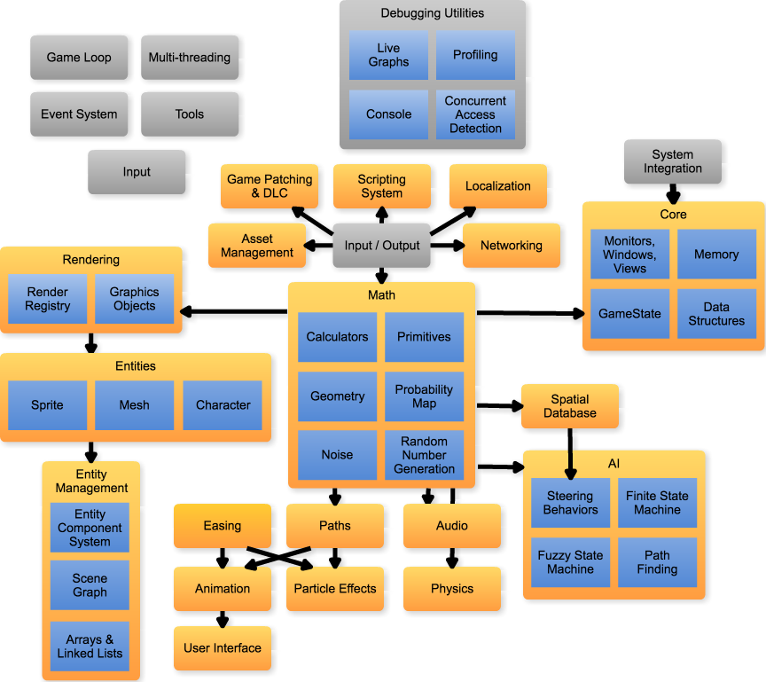

# Axe Game Engine Design

This project contains details on the architecture & design of Axe.

Each component that makes up Axe is broken up into it's own design with the
following information:
- Description
- Dependencies
- Sub-Components
- Terms
- Design

Axe components are designed to be easily incorporated into any code base, you do
not need to use Axe as the main game engine and you don't even need to use its
primitives (vectors, matrices, etc).

### Components

- [AI](components/AI.md)
- [Animation](components/Animation.md) (empty)
- [Asset Management](components/AssetManagement.md) (empty)
- [Audio](components/Audio.md)
- [Core](components/Core.md)
- [Debugging Utilities](components/DebuggingUtilities.md)
- [Easing](components/Easing.md)
- [Entity](components/Entity.md) (empty)
- [Entity Management](components/EntityManagement.md)
- [Event System](components/EventSystem.md)
- [Files & Streams](components/FilesStreams.md) (empty)
- [Game Loop](components/GameLoop.md)
- [Game Patches & DLC](components/GamePatchesDLC.md) (empty)
- [Gaming Services](components/GamingServices.md) (empty)
- [Input](components/Input.md)
- [Localization](components/Localization.md) (empty)
- [Maps](components/Maps.md) (empty)
- [Math](components/Math.md)
- [Multithreading](components/Multithreading.md) (empty)
- [Networking](components/Networking.md)
- [Particle Effects](components/ParticleEffects.md) (empty)
- [Paths](components/Paths.md)
- [Physics](components/Physics.md) (empty)
- [Profiles](components/Profiles.md)
- [Rendering](components/Rendering.md) (empty)
- [Screens](components/Screens.md)
- [Scripting System](components/ScriptingSystem.md) (empty)
- [Spatial Database](components/SpatialDatabase.md)
- [System Integration](components/SystemIntegration.md) (empty)
- [Tasks](components/Tasks.md)
- [Tools](components/Tools.md) (empty)
- [User Interface](components/UserInterface.md) (empty)

### Component Organization Diagram

